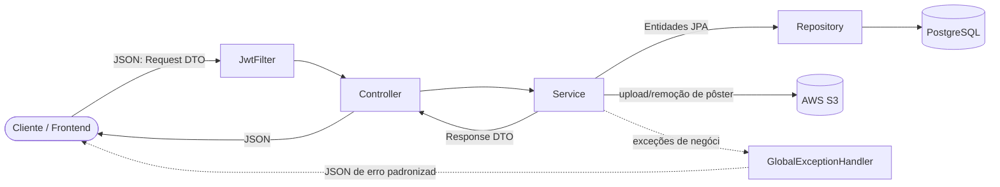
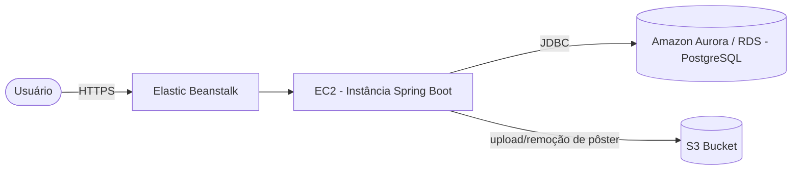
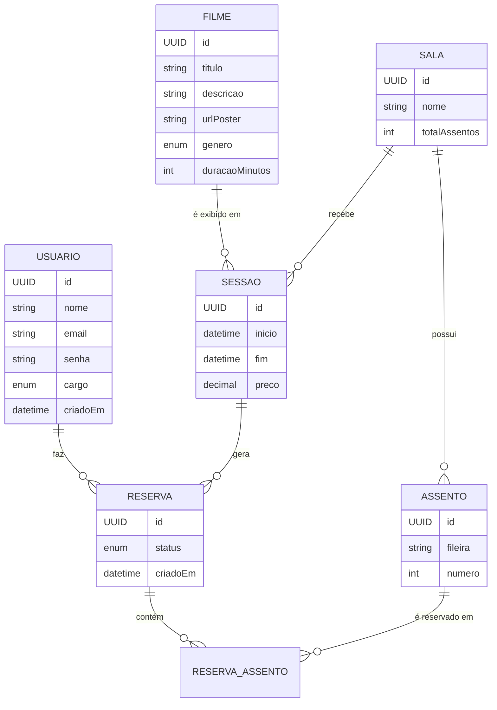

<div align="center">

# 🎬 Filmes API — Sistema de Reservas para Cinema

API REST completa para gerenciamento de filmes, salas, sessões e reservas de ingressos — inspirada em plataformas como **Ingresso.com** e **Cinemark**. Desenvolvida durante o curso presencial de **Backend Java Developer (SENAI)**, com arquitetura em camadas, padrão **DTO**, autenticação **JWT**, upload de imagens no **S3** e deploy na **AWS** com **Docker**.


🌐 **[Português](#-sobre-o-projeto)** | **[English](#-about-the-project)**

</div>

---

## 🇧🇷 Sobre o projeto

A **Filmes API** é o backend completo de um sistema de venda de ingressos de cinema. Um usuário se cadastra, consulta o catálogo de filmes e a programação de sessões, vê os assentos disponíveis em tempo real e reserva os que quiser — com o sistema impedindo automaticamente que dois usuários reservem o mesmo assento na mesma sessão. Um administrador gerencia o catálogo de filmes (incluindo upload de pôster), a estrutura das salas (com geração automática de assentos), as sessões de exibição e acompanha relatórios de receita.

O projeto foi construído do zero para treinar, na prática, os pilares de uma API backend profissional:

- **Arquitetura em camadas** (`Controller → Service → Repository → Model`)
- **Padrão DTO** (Data Transfer Object) com `record` do Java, separando completamente o que trafega na API do que é persistido no banco
- **Autenticação stateless com JWT** + autorização baseada em papéis (`ADMIN` / `USUARIO`)
- **Upload de imagens para AWS S3** (pôsteres de filmes)
- **Tratamento de erros centralizado** via `@RestControllerAdvice`
- **Documentação automática** via Swagger/OpenAPI
- **Containerização com Docker** (build multi-stage) e **deploy em nuvem na AWS**

### ✨ Destaques técnicos

- **Prevenção de overbooking**: antes de criar uma reserva, o sistema confere se *todos* os assentos pedidos estão livres — se um já estiver ocupado, nada é gravado. A operação inteira roda dentro de uma transação (`@Transactional`), garantindo "tudo ou nada".
- **Detecção de conflito de horário**: ao criar uma sessão, uma query JPQL verifica se já existe outra sessão na mesma sala com sobreposição de horário, usando o teste clássico de intervalos (`inicio < fim AND fim > inicio`).
- **Disponibilidade calculada, não armazenada**: o campo `disponivel` de um assento não existe como coluna no banco — é calculado na hora, cruzando os assentos da sala com as reservas ativas daquela sessão.
- **Geração procedural de assentos**: ao criar uma sala (ex.: 4 fileiras × 8 assentos), o sistema gera automaticamente A1–A8, B1–B8, C1–C8, D1–D8.
- **Upload de imagens com validação**: o `S3Service` aceita apenas JPEG/PNG/WebP, gera uma chave única (`posters/{uuid}.ext`) e remove a imagem antiga do bucket ao trocar ou excluir o pôster.
- **Segurança de propriedade do dado**: um usuário só pode cancelar a *própria* reserva — a verificação compara o e-mail do token com o dono da reserva, não apenas se o usuário está logado.
- **Tratamento de erro padronizado**: `GlobalExceptionHandler` converte exceções de negócio em respostas JSON consistentes (`status`, `erro`, `mensagem`, `timestamp`), e o próprio filtro JWT devolve 401 com corpo JSON em vez de uma página de erro genérica.

---

## 🧱 Stack técnica

| Camada | Tecnologia |
|---|---|
| Linguagem | Java 21 |
| Framework | Spring Boot 4.0.6 (Web MVC, Data JPA, Security, Validation) |
| Banco de dados | PostgreSQL (Amazon Aurora / RDS em produção) |
| Autenticação | JWT — JJWT 0.12.5 (api/impl/jackson) + BCrypt |
| Armazenamento de arquivos | AWS S3 (AWS SDK for Java v2) |
| Documentação | Swagger / OpenAPI — springdoc-openapi 3.0.2 |
| Build | Maven (com Maven Wrapper) |
| Boilerplate | Lombok (`@Getter`, `@Setter`, `@EqualsAndHashCode`) |
| Validação | Jakarta Bean Validation (`@NotBlank`, `@NotNull`, `@Email`, `@Min`) |
| Containerização | Docker (build multi-stage) + Docker Compose |
| Cloud (AWS) | Elastic Beanstalk · EC2 · Aurora/RDS · S3 |

---

## 🏗️ Arquitetura



### Infraestrutura na AWS



### Modelo de dados



---

## 📁 Estrutura do projeto

```
src/main/java/com/Senai/Filmes/
├── Config/
│   ├── DataInitializer.java         # cria o usuário ADMIN inicial no startup
│   ├── GlobalExceptionHandler.java  # tratamento de erros centralizado (@RestControllerAdvice)
│   ├── S3Config.java                # bean do cliente AWS S3
│   └── SwaggerConfig.java           # configuração do OpenAPI + botão "Authorize"
├── Controller/
│   ├── AdminController.java         # relatórios, listagem geral, promoção a admin
│   ├── AutenticacaoController.java  # cadastro e login
│   ├── FilmeController.java         # CRUD de filmes + upload/remoção de pôster
│   ├── ReservaController.java       # criar, listar e cancelar reservas
│   ├── SalaController.java          # CRUD de salas
│   └── SessaoController.java        # CRUD de sessões + assentos disponíveis
├── DTO/
│   ├── Request/                     # records de entrada
│   └── Response/                    # records de saída
├── Model/
│   ├── Enums/                       # Cargo, GeneroFilme, StatusReserva
│   ├── Usuario.java
│   ├── Filme.java
│   ├── Sala.java
│   ├── Assento.java
│   ├── Sessao.java
│   ├── Reserva.java
│   └── ReservaAssento.java          # tabela associativa Reserva ↔ Assento
├── Repository/                      # interfaces JpaRepository + queries JPQL customizadas
├── Security/
│   ├── JwtUtil.java                 # geração/validação do token JWT
│   ├── JwtFilter.java               # filtro que intercepta cada request
│   ├── SecurityConfig.java          # regras de autorização por rota
│   └── UserDetailsServiceImpl.java
├── Service/
│   ├── AdminService.java            # relatórios (Stream API) e promoção de usuários
│   ├── AutenticacaoService.java
│   ├── FilmeService.java
│   ├── ReservaService.java          # regra de negócio mais rica do projeto
│   ├── S3Service.java               # upload/remoção de imagens no S3
│   ├── SalaService.java             # geração automática de assentos
│   └── SessaoService.java           # checagem de conflito de horário
└── FilmesApplication.java
```

---

## ✅ Funcionalidades

| Módulo | Descrição |
|---|---|
| 🔐 Autenticação | Cadastro e login com JWT, senha com hash BCrypt, usuário já sai logado após o cadastro |
| 🛡️ Autorização | Controle de acesso por papel (`ADMIN` / `USUARIO`) via `@PreAuthorize` |
| 🎬 Filmes | CRUD completo + upload e remoção de pôster (AWS S3) |
| 🏛️ Salas | CRUD + geração automática de assentos (fileiras × assentos por fileira) |
| 🎟️ Sessões | CRUD + checagem de conflito de horário por sala + filtro por data ou por filme |
| 🪑 Assentos | Disponibilidade calculada em tempo real por sessão |
| 🎫 Reservas | Criação com checagem de duplicidade, listagem das próprias reservas, cancelamento (com checagem de dono e de sessão futura) |
| 📊 Administração | Listagem de todas as reservas, relatório de receita/reservas por filme, promoção de usuário a admin |
| ⚠️ Tratamento de erros | `GlobalExceptionHandler` com respostas JSON padronizadas (status, erro, mensagem, timestamp) |
| 📄 Documentação | Swagger UI com suporte a Bearer Token JWT |
| 🌱 Seed inicial | Criação automática de um usuário ADMIN ao subir a aplicação |

### Roadmap

- [ ] Testes automatizados com JUnit + Mockito (cobertura de `ReservaService` e `SessaoService` é prioridade)
- [ ] Paginação nas listagens (`GET /api/filmes`, `GET /api/admin/reservas`)
- [ ] Rate limiting no endpoint de login
- [ ] Pipeline de CI/CD para deploy automático na AWS

---

## 🔌 Endpoints

### Autenticação — `/api/auth` (público)

| Método | Rota | Descrição |
|---|---|---|
| `POST` | `/api/auth/cadastro` | Cria um novo usuário e já retorna o token JWT |
| `POST` | `/api/auth/login` | Autentica e retorna o token JWT |

### Filmes — `/api/filmes`

| Método | Rota | Descrição | Acesso |
|---|---|---|---|
| `GET` | `/api/filmes` | Lista todos os filmes | Público |
| `GET` | `/api/filmes/{id}` | Busca um filme por ID | Público |
| `POST` | `/api/filmes` | Cadastra um novo filme | 🔒 ADMIN |
| `PUT` | `/api/filmes/{id}` | Atualiza um filme | 🔒 ADMIN |
| `POST` | `/api/filmes/{id}/imagem` | Faz upload (ou substitui) o pôster no S3 | 🔒 ADMIN |
| `DELETE` | `/api/filmes/{id}/imagem` | Remove o pôster do S3 | 🔒 ADMIN |
| `DELETE` | `/api/filmes/{id}` | Remove um filme (e seu pôster do S3) | 🔒 ADMIN |

### Salas — `/api/salas`

| Método | Rota | Descrição | Acesso |
|---|---|---|---|
| `GET` | `/api/salas` | Lista todas as salas | Público |
| `GET` | `/api/salas/{id}` | Busca uma sala por ID | Público |
| `POST` | `/api/salas` | Cria uma sala (gera os assentos automaticamente) | 🔒 ADMIN |
| `DELETE` | `/api/salas/{id}` | Remove uma sala | 🔒 ADMIN |

### Sessões — `/api/sessoes`

| Método | Rota | Descrição | Acesso |
|---|---|---|---|
| `GET` | `/api/sessoes?data=AAAA-MM-DD` | Lista sessões de uma data | Público |
| `GET` | `/api/sessoes?filmeId={id}` | Lista sessões de um filme | Público |
| `GET` | `/api/sessoes/{id}` | Detalha uma sessão | Público |
| `GET` | `/api/sessoes/{id}/assentos` | Lista assentos com disponibilidade | 🔒 Logado |
| `POST` | `/api/sessoes` | Cria uma sessão (com checagem de conflito de sala) | 🔒 ADMIN |
| `DELETE` | `/api/sessoes/{id}` | Remove uma sessão | 🔒 ADMIN |

### Reservas — `/api/reservas` (exige login)

| Método | Rota | Descrição |
|---|---|---|
| `POST` | `/api/reservas` | Reserva um ou mais assentos para uma sessão |
| `GET` | `/api/reservas/minhas` | Lista as reservas do usuário autenticado |
| `DELETE` | `/api/reservas/{id}` | Cancela uma reserva própria |

### Administração — `/api/admin` (exige `ADMIN`)

| Método | Rota | Descrição |
|---|---|---|
| `GET` | `/api/admin/reservas` | Lista todas as reservas do sistema |
| `GET` | `/api/admin/relatorios` | Relatório de receita e reservas por filme |
| `PATCH` | `/api/admin/usuarios/{id}/promover` | Promove um usuário a ADMIN |

---

## 🔐 Segurança

- Autenticação **stateless** (`SessionCreationPolicy.STATELESS`) — cada requisição se autentica sozinha pelo token, sem sessão no servidor
- Senhas com hash **BCrypt**, nunca em texto puro
- Token JWT assinado com **HMAC-SHA256**, com o e-mail como `subject` e expiração configurável
- `JwtFilter` intercepta toda requisição: token ausente segue sem autenticar (a rota barra depois, se exigir login); token inválido/expirado retorna `401` com corpo JSON
- Autorização declarativa por método com `@PreAuthorize`, incluindo proteção em nível de classe inteira no `AdminController`
- `AuthenticationEntryPoint` e `AccessDeniedHandler` customizados devolvem JSON (`401`/`403`) em vez da página de erro padrão do Spring
- Verificação de **propriedade do dado**: cancelar uma reserva exige que o e-mail do token bata com o dono da reserva — estar logado não basta
- Upload de imagem restrito a `image/jpeg`, `image/png` e `image/webp`

---

## ☁️ Upload de imagens (AWS S3)

O `S3Service` cuida do ciclo de vida do pôster de cada filme:

1. Valida o tipo do arquivo (apenas JPEG/PNG/WebP)
2. Gera uma chave única: `posters/{uuid}.{extensao}`
3. Envia o arquivo ao bucket via AWS SDK v2 (`PutObjectRequest`)
4. Ao trocar ou remover o pôster, apaga o objeto anterior do S3 antes de gravar o novo (evita arquivos órfãos no bucket)

---

## 🚀 Como executar localmente

### Pré-requisitos

- Java 21
- PostgreSQL 15+ (ou Docker)
- Conta AWS com um bucket S3 (ou comente temporariamente o upload de imagem se for só testar o resto da API)

### 1. Clonar o repositório

```bash
git clone https://github.com/Baister/filmes-api.git
cd filmes-api
```

### 2. Configurar as variáveis de ambiente

Crie um arquivo `.env` na raiz do projeto (o `application.properties` já está pronto para lê-lo):

```env
PGHOST=localhost
PGPORT=5432
PGDATABASE=cinema_db
PGUSER=postgres
PGPASSWORD=sua_senha

JWT_SECRET=uma_chave_secreta_com_pelo_menos_256_bits
ADMIN_EMAIL=admin@cinema.com
ADMIN_SENHA=Admin@123

AWS_REGION=us-east-1
AWS_ACCESS_KEY_ID=sua_access_key
AWS_SECRET_ACCESS_KEY=sua_secret_key
AWS_SESSION_TOKEN=seu_session_token
S3_BUCKET_NAME=seu-bucket
```

> ⚠️ **Nunca commite o `.env`** — ele contém credenciais reais de banco e AWS. Confirme que `.env` está listado no seu `.gitignore` antes de subir o projeto pro GitHub.

### 3. Rodar a aplicação

```bash
./mvnw spring-boot:run
```

### 4. Acessar a documentação

```
http://localhost:8080/swagger-ui.html
```

### Rodando com Docker Compose

O projeto já vem com um `docker-compose.yml` que sobe a API **e** um PostgreSQL local:

```bash
docker compose up --build
```

O Dockerfile usa **build multi-stage** (Maven + JDK no estágio de build, apenas JRE Alpine no estágio final), roda como usuário não-root e respeita os limites de memória do container via `-XX:MaxRAMPercentage`.

---

## ☁️ Deploy

Em produção, a aplicação roda na **AWS**, com:

- **Elastic Beanstalk** orquestrando o deploy e o ciclo de vida da aplicação
- **EC2** hospedando a instância Spring Boot
- **Amazon Aurora / RDS (PostgreSQL)** como banco de dados gerenciado
- **S3** para armazenamento dos pôsteres dos filmes

---

## 👨‍💻 Autor

**Gustavo**
Auxiliar de TI @ Diproseg Penha · Estudante de Backend Java Developer (SENAI) · Bacharel em Análise e Desenvolvimento de Sistemas (Universidade Anhembi Morumbi)

[GitHub](https://github.com/Baister) · LinkedIn:linkedin.com/in/gustavo-baister/

---
---

## 🇺🇸 About the project

**Filmes API** is the complete backend of a movie ticketing system. Users sign up, browse the movie catalog and showtime schedule, see real-time seat availability and book the seats they want — with the system automatically preventing two users from booking the same seat for the same showtime. An admin manages the movie catalog (including poster upload), the room layout (with automatic seat generation), showtimes, and tracks revenue reports.

The project was built from scratch as a practical exercise in the core pillars of a professional backend API:

- **Layered architecture** (`Controller → Service → Repository → Model`)
- **DTO pattern** using Java `record`s, fully decoupling what's exposed by the API from what's persisted in the database
- **Stateless JWT authentication** + role-based authorization (`ADMIN` / `USUARIO`)
- **Image upload to AWS S3** (movie posters)
- **Centralized error handling** via `@RestControllerAdvice`
- **Auto-generated API documentation** via Swagger/OpenAPI
- **Containerization with Docker** (multi-stage build) and **cloud deployment on AWS**

### ✨ Technical highlights

- **Overbooking prevention**: before creating a booking, the system checks that *every* requested seat is free — if even one is already taken, nothing is persisted. The whole operation runs inside a transaction (`@Transactional`), guaranteeing all-or-nothing behavior.
- **Schedule conflict detection**: when a showtime is created, a JPQL query checks whether another showtime already overlaps in the same room, using the classic interval-overlap test (`start < end AND end > start`).
- **Computed, not stored, availability**: a seat's `disponivel` (available) flag isn't a database column — it's computed on the fly by cross-referencing the room's seats against that showtime's active bookings.
- **Procedural seat generation**: creating a room (e.g. 4 rows × 8 seats) automatically generates A1–A8, B1–B8, C1–C8, D1–D8.
- **Validated image upload**: `S3Service` only accepts JPEG/PNG/WebP, generates a unique key (`posters/{uuid}.ext`), and deletes the previous image from the bucket whenever the poster is replaced or removed.
- **Data-ownership security**: a user can only cancel their *own* booking — the check compares the token's email against the booking's owner, not just whether the user is logged in.
- **Standardized error handling**: `GlobalExceptionHandler` converts business exceptions into consistent JSON responses (`status`, `erro`, `mensagem`, `timestamp`), and the JWT filter itself returns a 401 with a JSON body instead of a generic error page.

---

## 🧱 Tech stack

| Layer | Technology |
|---|---|
| Language | Java 21 |
| Framework | Spring Boot 4.0.6 (Web MVC, Data JPA, Security, Validation) |
| Database | PostgreSQL (Amazon Aurora / RDS in production) |
| Auth | JWT — JJWT 0.12.5 (api/impl/jackson) + BCrypt |
| File storage | AWS S3 (AWS SDK for Java v2) |
| Docs | Swagger / OpenAPI — springdoc-openapi 3.0.2 |
| Build | Maven (with Maven Wrapper) |
| Boilerplate | Lombok (`@Getter`, `@Setter`, `@EqualsAndHashCode`) |
| Validation | Jakarta Bean Validation (`@NotBlank`, `@NotNull`, `@Email`, `@Min`) |
| Containerization | Docker (multi-stage build) + Docker Compose |
| Cloud (AWS) | Elastic Beanstalk · EC2 · Aurora/RDS · S3 |

---

## ✅ Features

| Module | Description |
|---|---|
| 🔐 Authentication | Sign-up and login with JWT, BCrypt password hashing, user is logged in immediately after sign-up |
| 🛡️ Authorization | Role-based access control (`ADMIN` / `USUARIO`) via `@PreAuthorize` |
| 🎬 Movies | Full CRUD + poster upload/removal (AWS S3) |
| 🏛️ Rooms | CRUD + automatic seat generation (rows × seats per row) |
| 🎟️ Showtimes | CRUD + room schedule-conflict checking + filter by date or by movie |
| 🪑 Seats | Real-time computed availability per showtime |
| 🎫 Bookings | Creation with duplicate-seat checking, listing of own bookings, cancellation (with ownership and future-showtime checks) |
| 📊 Admin | Listing of all bookings, revenue/booking report per movie, promoting a user to admin |
| ⚠️ Error handling | `GlobalExceptionHandler` with standardized JSON responses (status, error, message, timestamp) |
| 📄 Docs | Swagger UI with JWT Bearer Token support |
| 🌱 Initial seed | Auto-creates an ADMIN user on application startup |

### Roadmap

- [ ] Automated tests with JUnit + Mockito (coverage of `ReservaService` and `SessaoService` is the priority)
- [ ] Pagination on list endpoints (`GET /api/filmes`, `GET /api/admin/reservas`)
- [ ] Rate limiting on the login endpoint
- [ ] CI/CD pipeline for automatic AWS deployment

---

## 🔌 Endpoints

### Auth — `/api/auth` (public)

| Method | Route | Description |
|---|---|---|
| `POST` | `/api/auth/cadastro` | Registers a new user and returns a JWT token |
| `POST` | `/api/auth/login` | Authenticates and returns a JWT token |

### Movies — `/api/filmes`

| Method | Route | Description | Access |
|---|---|---|---|
| `GET` | `/api/filmes` | Lists all movies | Public |
| `GET` | `/api/filmes/{id}` | Gets a movie by ID | Public |
| `POST` | `/api/filmes` | Creates a new movie | 🔒 ADMIN |
| `PUT` | `/api/filmes/{id}` | Updates a movie | 🔒 ADMIN |
| `POST` | `/api/filmes/{id}/imagem` | Uploads (or replaces) the poster on S3 | 🔒 ADMIN |
| `DELETE` | `/api/filmes/{id}/imagem` | Removes the poster from S3 | 🔒 ADMIN |
| `DELETE` | `/api/filmes/{id}` | Deletes a movie (and its S3 poster) | 🔒 ADMIN |

### Rooms — `/api/salas`

| Method | Route | Description | Access |
|---|---|---|---|
| `GET` | `/api/salas` | Lists all rooms | Public |
| `GET` | `/api/salas/{id}` | Gets a room by ID | Public |
| `POST` | `/api/salas` | Creates a room (auto-generates seats) | 🔒 ADMIN |
| `DELETE` | `/api/salas/{id}` | Deletes a room | 🔒 ADMIN |

### Showtimes — `/api/sessoes`

| Method | Route | Description | Access |
|---|---|---|---|
| `GET` | `/api/sessoes?data=YYYY-MM-DD` | Lists showtimes for a date | Public |
| `GET` | `/api/sessoes?filmeId={id}` | Lists showtimes for a movie | Public |
| `GET` | `/api/sessoes/{id}` | Gets showtime details | Public |
| `GET` | `/api/sessoes/{id}/assentos` | Lists seats with availability | 🔒 Logged in |
| `POST` | `/api/sessoes` | Creates a showtime (with room conflict check) | 🔒 ADMIN |
| `DELETE` | `/api/sessoes/{id}` | Deletes a showtime | 🔒 ADMIN |

### Bookings — `/api/reservas` (login required)

| Method | Route | Description |
|---|---|---|
| `POST` | `/api/reservas` | Books one or more seats for a showtime |
| `GET` | `/api/reservas/minhas` | Lists the authenticated user's bookings |
| `DELETE` | `/api/reservas/{id}` | Cancels an own booking |

### Admin — `/api/admin` (`ADMIN` required)

| Method | Route | Description |
|---|---|---|
| `GET` | `/api/admin/reservas` | Lists every booking in the system |
| `GET` | `/api/admin/relatorios` | Revenue and bookings report per movie |
| `PATCH` | `/api/admin/usuarios/{id}/promover` | Promotes a user to ADMIN |

---

## 🔐 Security

- **Stateless** authentication (`SessionCreationPolicy.STATELESS`) — every request authenticates itself via the token, no server-side session
- Passwords hashed with **BCrypt**, never stored in plain text
- JWT signed with **HMAC-SHA256**, with the user's email as `subject` and a configurable expiration
- `JwtFilter` intercepts every request: a missing token passes through unauthenticated (the route blocks it later if login is required); an invalid/expired token returns `401` with a JSON body
- Declarative method-level authorization with `@PreAuthorize`, including whole-class protection on `AdminController`
- Custom `AuthenticationEntryPoint` and `AccessDeniedHandler` return JSON (`401`/`403`) instead of Spring's default error page
- **Data-ownership checks**: cancelling a booking requires the token's email to match the booking's owner — being logged in alone isn't enough
- Image upload restricted to `image/jpeg`, `image/png` and `image/webp`

---

## ☁️ Image upload (AWS S3)

`S3Service` handles the full lifecycle of each movie's poster:

1. Validates the file type (JPEG/PNG/WebP only)
2. Generates a unique key: `posters/{uuid}.{extension}`
3. Uploads the file to the bucket via AWS SDK v2 (`PutObjectRequest`)
4. When the poster is replaced or removed, the previous object is deleted from S3 first, preventing orphaned files in the bucket

---

## 🚀 Running locally

### Prerequisites

- Java 21
- PostgreSQL 15+ (or Docker)
- An AWS account with an S3 bucket (or temporarily comment out the image upload feature if you just want to test the rest of the API)

### 1. Clone the repository

```bash
git clone https://github.com/Baister/filmes-api.git
cd filmes-api
```

### 2. Configure environment variables

Create a `.env` file at the project root (`application.properties` is already wired to read it):

```env
PGHOST=localhost
PGPORT=5432
PGDATABASE=cinema_db
PGUSER=postgres
PGPASSWORD=your_password

JWT_SECRET=a_secret_key_at_least_256_bits_long
ADMIN_EMAIL=admin@cinema.com
ADMIN_SENHA=Admin@123

AWS_REGION=us-east-1
AWS_ACCESS_KEY_ID=your_access_key
AWS_SECRET_ACCESS_KEY=your_secret_key
AWS_SESSION_TOKEN=your_session_token
S3_BUCKET_NAME=your-bucket
```

> ⚠️ **Never commit your `.env`** — it holds real database and AWS credentials. Make sure `.env` is listed in your `.gitignore` before pushing to GitHub.

### 3. Run the application

```bash
./mvnw spring-boot:run
```

### 4. Open the docs

```
http://localhost:8080/swagger-ui.html
```

### Running with Docker Compose

The project ships with a `docker-compose.yml` that spins up the API **and** a local PostgreSQL instance:

```bash
docker compose up --build
```

The Dockerfile uses a **multi-stage build** (Maven + JDK for the build stage, JRE Alpine only for the final stage), runs as a non-root user, and respects container memory limits via `-XX:MaxRAMPercentage`.

---

## ☁️ Deployment

In production, the application runs on **AWS**, with:

- **Elastic Beanstalk** orchestrating deployment and the application's lifecycle
- **EC2** hosting the Spring Boot instance
- **Amazon Aurora / RDS (PostgreSQL)** as the managed database
- **S3** for storing movie posters

---

## 👨‍💻 Author

**Gustavo**
IT Support Analyst @ Diproseg Penha · Backend Java Developer student (SENAI) · B.Sc. in Systems Analysis and Development (Universidade Anhembi Morumbi)

[GitHub](https://github.com/Baister) · LinkedIn: linkedin.com/in/gustavo-baister/
